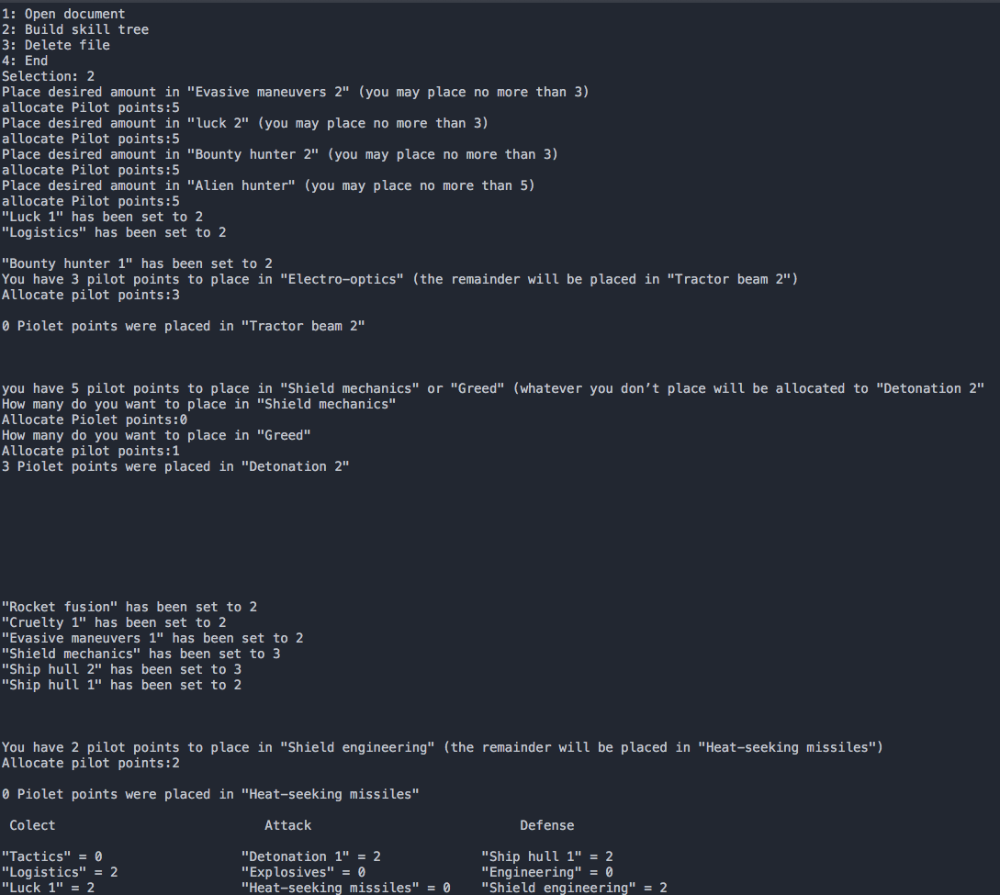
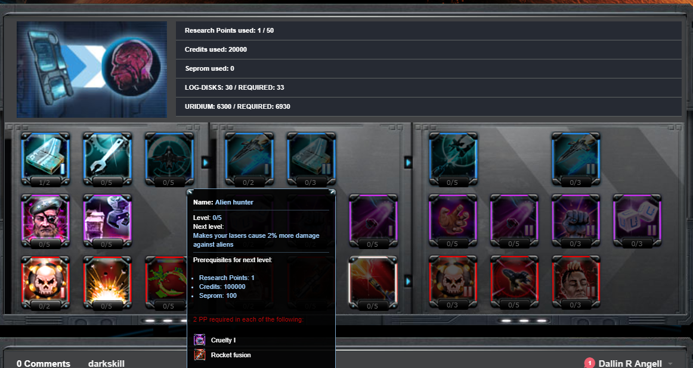

##A little about Darkorbit
This program is designed to help Darkorbit gamers to build their skill trees. Darkorbit.com is an internet game in which you are a space pilot that mines for materials and kill ships N.P.C. (Non-player character) and P.V.P (player versus player). The skill tree allows you to increase your ability to fight and collect. The four main skills you want to increase are Evasive maneuvers 2, luck 2, bounty hunter, and alien hunter. If you are new to the game you might want to upgrade luck 2 and any other skill to help you collect better. Uridum is the most valuable and rare currency in the game so keep that in mind were credits not worth allocating pilot points just focus on attack defense and Uridum collection. You may have only 50 pilot points to use so use them wisely. Resetting them will cost a lot of resources.

##Using my program
When you run my code, it is recommended to have www.darkskill.info open as well or your skill tree in the game open. This is what my program will look like when you are building the skill tree. The program should be pretty self-explanatory just place the pilot point amounts when it tells you. Many of the pilot points will be set automatically to fulfill the requirements.

Hover over the item that corresponds with the item you are thinking of allocating points to on the website www.darkskill.info to get more information about the skill. The website should look like this.

